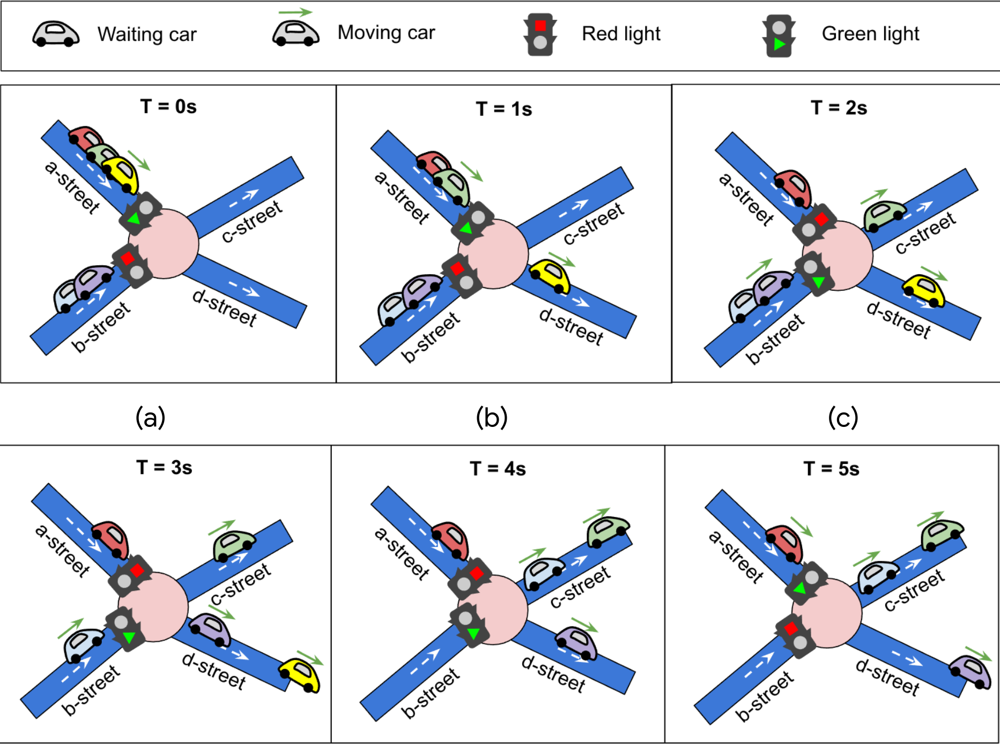

# \# Hash Code 2021 Online Qualifications

Solutions and code for the _Online Qualifications_ of [Hash Code 2021](https://g.co/hashcode) **"Traffic Signaling"**.  
Hash Code 2021 Online Qualifications Livestream
[was](https://codingcompetitionsonair.withgoogle.com/events/hashcode-2021-qual?talk=hc2021-oqlive)
[available](http://goo.gle/hashcode-livestream)
[here](https://www.youtube.com/watch?v=YPOVd-hQUjA).

#### Introduction

> The world's first traffic light dates back to 1868.
> It was installed in London to control traffic for... horse-drawn vehicles!
> Today, traffic lights can be found at street intersections in almost every city in the world,
> making it safer for vehicles to go through them.
> Traffic lights have at least two states, and use one color (usually red) to signal "stop",
> and another (usually green) to signal that cars can proceed through.
> The very first traffic lights were manually controlled.
> Nowadays they are automatic, meaning that they have to be carefully designed and
> timed in order to optimize the overall travel time for all the participants in traffic.
> 
> 
> 
> _from the [Problem statement for the Online Qualifications of Hash Code 2021][problem-statement]_

#### Task

> Given the description of a city plan and planned paths for all cars in that city,
> optimize the schedule of traffic lights to minimize the total amount of time spent in traffic,
> and help as many cars as possible reach their destination before a given deadline.
> 
> _from the [Problem statement for the Online Qualifications of Hash Code 2021][problem-statement]_

#### Scoring

See the section on scoring in the [Problem statement for the Online Qualifications of Hash Code 2021][problem-statement] for more details.

#### Input

The input files can be found in [`input/`](input)

| Data Set                                           | Duration | Intersections | Streets | Cars | Bonus Points |
| -------------------------------------------------- | -------- | ------------- | ------- | ---- | ------------ |
| [a_an_example.txt](input/a_an_example.txt)         | 6        | 4             | 5       | 2    | 1000         |
| [b_by_the_ocean.txt](input/b_by_the_ocean.txt)     | 5070     | 7073          | 9102    | 1000 | 1000         |
| [c_checkmate.txt](input/c_checkmate.txt)           | 10000    | 10000         | 35030   | 1000 | 100          |
| [d_daily_commute.txt](input/d_daily_commute.txt)   | 8071     | 8000          | 95928   | 1000 | 1000         |
| [e_etoile.txt](input/e_etoile.txt)                 | 676      | 500           | 998     | 1000 | 500          |
| [f_forever_jammed.txt](input/f_forever_jammed.txt) | 1992     | 1662          | 10000   | 1000 | 500          |

[problem-statement]: hashcode_2021_online_qualifications.pdf
