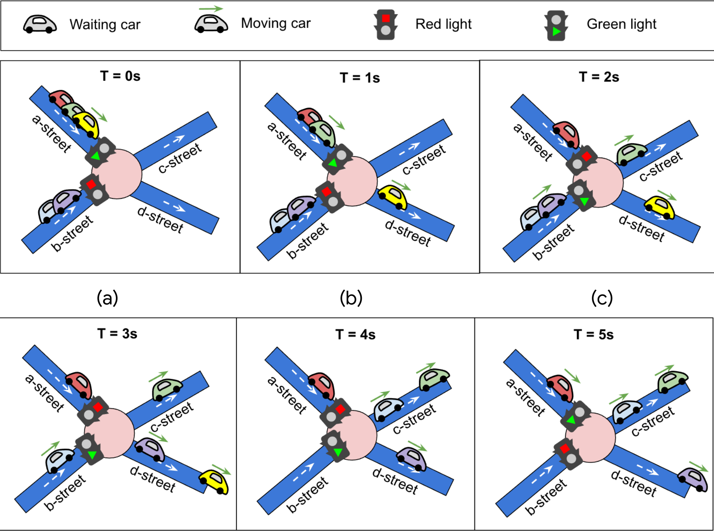

# \# Hash Code 2021 Online Qualifications

Solutions and code for the _Online Qualifications_ of [Hash Code 2021](https://g.co/hashcode) **"Traffic Signaling"**.  
Hash Code 2021 Online Qualifications Livestream
[was](https://codingcompetitionsonair.withgoogle.com/events/hashcode-2021-qual?talk=hc2021-oqlive)
[available](http://goo.gle/hashcode-livestream)
[here](https://www.youtube.com/watch?v=YPOVd-hQUjA).

#### Introduction

> The world's first traffic light dates back to 1868.
> It was installed in London to control traffic for... horse-drawn vehicles!
> Today, traffic lights can be found at street intersections in almost every city in the world,
> making it safer for vehicles to go through them.
> Traffic lights have at least two states, and use one color (usually red) to signal "stop",
> and another (usually green) to signal that cars can proceed through.
> The very first traffic lights were manually controlled.
> Nowadays they are automatic, meaning that they have to be carefully designed and
> timed in order to optimize the overall travel time for all the participants in traffic.
> 
> 
> 
> _from the [Problem statement for the Online Qualifications of Hash Code 2021][problem-statement]_

#### Task

> Given the description of a city plan and planned paths for all cars in that city,
> optimize the schedule of traffic lights to minimize the total amount of time spent in traffic,
> and help as many cars as possible reach their destination before a given deadline.
> 
> _from the [Problem statement for the Online Qualifications of Hash Code 2021][problem-statement]_

#### Scoring

See the section on scoring in the [Problem statement for the Online Qualifications of Hash Code 2021][problem-statement] for more details.

#### Input

The input files can be found in [`input/`](input)

| Data Set                                           | Duration | Intersections | Streets | Cars | Bonus Points |
| -------------------------------------------------- | -------- | ------------- | ------- | ---- | ------------ |
| [a_an_example.txt](input/a_an_example.txt)         | 6        | 4             | 5       | 2    | 1000         |
| [b_by_the_ocean.txt](input/b_by_the_ocean.txt)     | 5070     | 7073          | 9102    | 1000 | 1000         |
| [c_checkmate.txt](input/c_checkmate.txt)           | 10000    | 10000         | 35030   | 1000 | 100          |
| [d_daily_commute.txt](input/d_daily_commute.txt)   | 8071     | 8000          | 95928   | 1000 | 1000         |
| [e_etoile.txt](input/e_etoile.txt)                 | 676      | 500           | 998     | 1000 | 500          |
| [f_forever_jammed.txt](input/f_forever_jammed.txt) | 1992     | 1662          | 10000   | 1000 | 500          |

## Scores

Overall **9,092,476** points (2123st place).
See the complete scoreboard [here](hashcode_2021_online_qualifications_scoreboard.zip).

#### A – An example

Our submission scored **2,002** points.

> The submission scored 2,002 points. This is the sum of 2,000 bonus points for cars arriving before the deadline (1,000 points each) and 2 points for early arrival times.
>
> 2 of 2 cars arrived before the deadline (100%). The earliest car arrived at its destination after 4 seconds scoring 1,002 points, whereas the last car arrived at its destination after 6 seconds scoring 1,000 points. Cars that arrived within the deadline drove for an average of 5.00 seconds to arrive at their destination.
>
> The schedules for the 4 traffic lights had an average total cycle length of 1.25 seconds. A traffic light that turned green was scheduled to stay green for 1.00 seconds on average.

#### B – By the ocean

Our submission scored **4,565,520** points.

> The submission scored 4,565,520 points. This is the sum of 1,000,000 bonus points for cars arriving before the deadline (1,000 points each) and 3,565,520 points for early arrival times.
>
> 1,000 of 1,000 cars arrived before the deadline (100%). The earliest car arrived at its destination after 601 seconds scoring 5,469 points, whereas the last car arrived at its destination after 5,039 seconds scoring 1,031 points. Cars that arrived within the deadline drove for an average of 1504.48 seconds to arrive at their destination.
>
> The schedules for the 7,073 traffic lights had an average total cycle length of 1.63 seconds. A traffic light that turned green was scheduled to stay green for 1.31 seconds on average.

#### C – Checkmate

Our submission scored **1,284,764** points.

> The submission scored 1,284,764 points. This is the sum of 99,700 bonus points for cars arriving before the deadline (100 points each) and 1,185,064 points for early arrival times.
>
> 997 of 1,000 cars arrived before the deadline (100%). The earliest car arrived at its destination after 6 seconds scoring 1,734 points, whereas the last car arrived at its destination after 1,628 seconds scoring 112 points. Cars that arrived within the deadline drove for an average of 451.37 seconds to arrive at their destination.
>
> The schedules for the 10,000 traffic lights had an average total cycle length of 3.07 seconds. A traffic light that turned green was scheduled to stay green for 2.58 seconds on average.

#### D – Daily commute

Our submission scored **1,591,572** points.

> The submission scored 1,591,572 points. This is the sum of 959,000 bonus points for cars arriving before the deadline (1,000 points each) and 632,572 points for early arrival times.
>
> 959 of 1,000 cars arrived before the deadline (96%). The earliest car arrived at its destination after 6,333 seconds scoring 2,738 points, whereas the last car arrived at its destination after 8,064 seconds scoring 1,007 points. Cars that arrived within the deadline drove for an average of 7411.38 seconds to arrive at their destination.
>
> The schedules for the 8,000 traffic lights had an average total cycle length of 10.50 seconds. A traffic light that turned green was scheduled to stay green for 1.00 seconds on average.

#### E – Etoile

Our submission scored **687,112** points.

> The submission scored 687,112 points. This is the sum of 402,000 bonus points for cars arriving before the deadline (500 points each) and 285,112 points for early arrival times.
>
> 804 of 1,000 cars arrived before the deadline (80%). The earliest car arrived at its destination after 18 seconds scoring 1,158 points, whereas the last car arrived at its destination after 675 seconds scoring 501 points. Cars that arrived within the deadline drove for an average of 321.38 seconds to arrive at their destination.
>
> The schedules for the 500 traffic lights had an average total cycle length of 3.71 seconds. A traffic light that turned green was scheduled to stay green for 1.93 seconds on average.

#### F – Forever jammed

Our submission scored **961,506** points.

> The submission scored 961,506 points. This is the sum of 280,000 bonus points for cars arriving before the deadline (500 points each) and 681,506 points for early arrival times.
>
> 560 of 1,000 cars arrived before the deadline (56%). The earliest car arrived at its destination after 4 seconds scoring 2,488 points, whereas the last car arrived at its destination after 1,980 seconds scoring 512 points. Cars that arrived within the deadline drove for an average of 775.03 seconds to arrive at their destination.
>
> The schedules for the 1,662 traffic lights had an average total cycle length of 44.81 seconds. A traffic light that turned green was scheduled to stay green for 13.35 seconds on average.

[problem-statement]: hashcode_2021_online_qualifications.pdf
